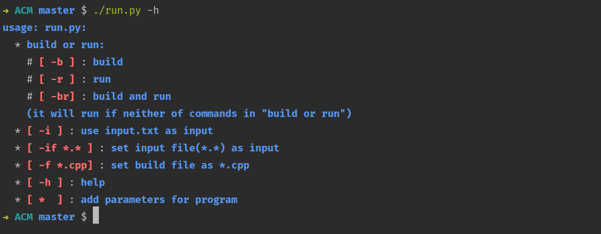

# ACM Template
[]()
[]()

## 关于项目
- 在 `./template/` 寻找算法模板.

- 环境要求:
  - [x] `gcc / g++`
    
    - Mac OS: `brew install gcc`, 一般系统内置gcc环境
    - Windows:
    
      | MinGw | [下载地址](https://osdn.net/projects/mingw/downloads/68260/mingw-get-setup.exe/) |
      | :-----: | :-----: |
      | CygWin | [下载地址](https://cygwin.com/setup-x86_64.exe) |
    - Linux: 
    
      | ubuntu | `sudo apt install gcc` |
      | :-----: | :-----: |
      | CentOS | `sudo yum install gcc` |  
  - [x] `python3`
    
    - Windows:[下载地址](https://www.python.org/downloads/)
    - MacOS: 
    
      | 安装包 | [下载地址](https://www.python.org/ftp/python/3.7.4/python-3.7.4-macosx10.9.pkg) |
      | :-----: | :-----: |
      | 命令 | `brew install python3` |
    - Linux: 
      ```shell script
      wget https://www.python.org/ftp/python/3.7.4/Python-3.7.4.tgz
      tar -zxvf Python-3.7.4.tgz
      cd Python-3.7.4
      ./configure --prefix=/usr/local/python3
      make && make install
      ```
## 关于内置脚本

  - 使用Qpro，自动为你的CLion Project配置下面的脚本:
  
    | 安装 | `pip3 install Qpro` |
    | :-----: | :-----: |
    | 使用方法 | [Qpro使用方法](https://pypi.org/project/Qpro/) |
  - 脚本问题与解决方案:
  
    | 问题 | 解决方案 |
    | :-----: | :-----: |
    | `zsh: permission denied: *.py` | `chmod a+x *.py` |
### 运行脚本:

  - 编译或运行
  
      | 参数 | 含义 |
      | :----- | :----- |
      | -b | 编译 |
      | -r | 运行 |
      | -br | 编译且运行 |
      
      如果上述三个命令都不存在，则默认运行当前编译好的程序

      | -f `*.c` / `*.cpp` | 设置目标源文件 |
      | :----- | :----- |
      
  - 输入输出:
      
      - 可以编辑 `./cmake-build-debug/input.txt` 来设置默认输入
      - 运行 `./run.py [...] > output.txt` 使程序输出到 `./output.txt`
      
      | 参数 | 效果 |
      | :----- | :----- |
      | -i | 使用`./cmake-build-debug/input.txt`作为输入 |
      | -if `*.*` | 更改输入文件 |
      | -if -paste | 使用粘贴板内容作为输入 |
      
  - 程序的额外命令行参数:
  
      - 在符合上述命令规则情况下，你可以在任意位置加入参数，这些参数将传递给编译出的程序。
      
  - 查看帮助
      
      - `./run.py -h` : 可以查看使用帮助(Windows系统不支持颜色显示)
         
  
  - 推荐的命令示例:
      
      | 命令 | 效果 |
      | :----- | :----- |
      | `./run.py -i` | 使用默认输入文件并运行 |
      | `./run.py`| 运行 |
      | `./run.py -br -i` |  编译且使用输入文件运行 |
  
  - 修改config字典来调整脚本默认配置
  
      | 键值 | 含义 | 默认 |
      | :----- | :----- | :----- | 
      | `compile_tool` | (编译工具, 编译后缀) | (gcc, '') / (g++, '') / ... |
      | `compile_filename` | 待编译的文件 | main.cpp / main.c |
      | `executable_filename` | 编译出的可执行文件名 | 项目名 |
      | `input_file` | 默认的输入文件 | `./cmake-build-debug/input.txt`|

### 刷新脚本:

  - 运行 `./refresh.py` 来初始化 `main.cpp` 为存储在 `./template/main` 文件中的内容。

### 对拍器

  - 运行: `python3 TextCmp.py` 来进行两个CPP运行结果的对拍，结果存储在当前目录下的`./res.html`。
  - 如果脚本未能自动打开`./res.html`, 你可以用浏览器打开它。
  
